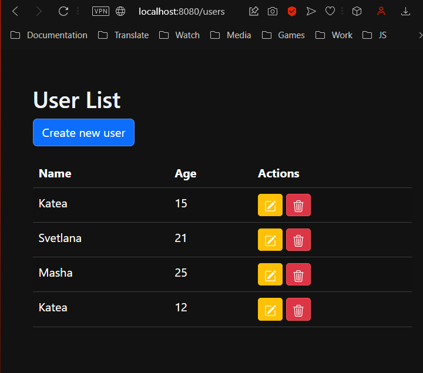
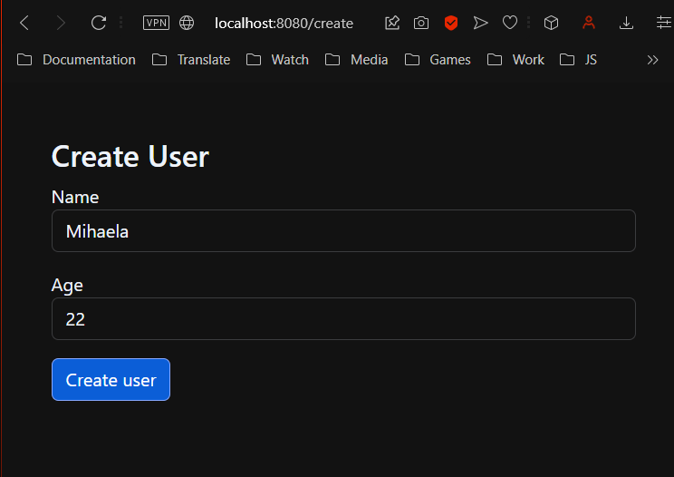
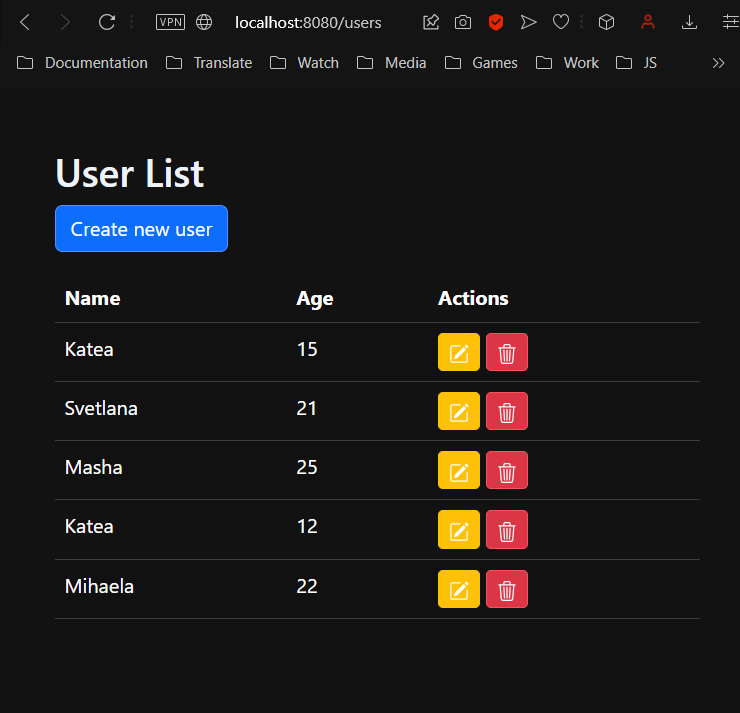
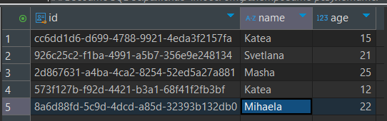
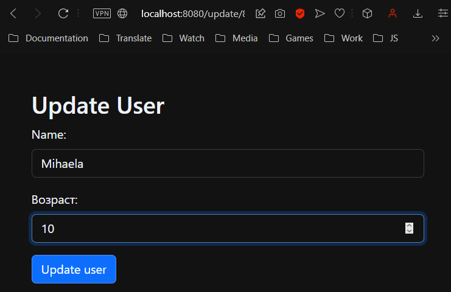
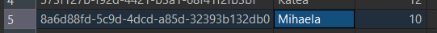
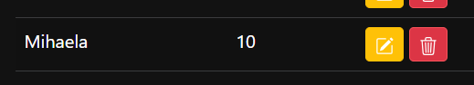
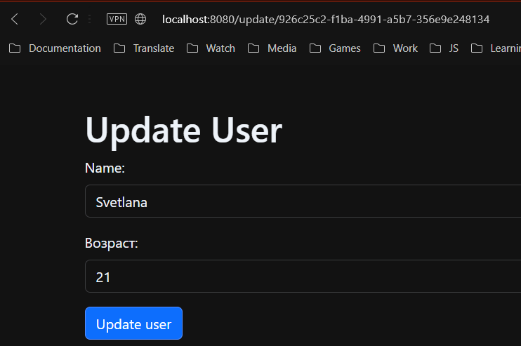
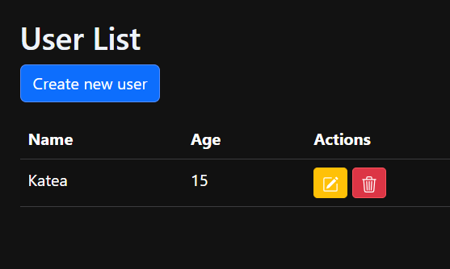
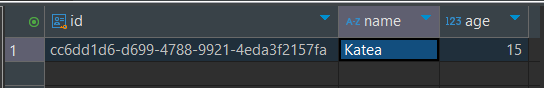

## Overview
This project is a User Management System built using Spring Boot and PostgreSQL. It provides a simple interface for creating, updating, and deleting user records, demonstrating the principles of RESTful architecture. The application follows the **Model-View-Controller (MVC)** design pattern to separate concerns and improve maintainability.

## Features
- **User Management**: Create, update, view, and delete users.
- **Data Persistence**: User data is stored in a PostgreSQL database.
- **RESTful API**: Supports standard HTTP methods for managing users.

## Technologies Used
- **Spring Boot**: Framework for building the application.
- **PostgreSQL**: Database for storing user data.
- **Thymeleaf**: Templating engine for rendering views.
- **Spring Web**: For handling web requests and responses.
- **Lombok**: To reduce boilerplate code in model classes.
- **Maven**: Dependency management and build tool.

## Screenshots

### User List Page

### Create User Page

- After creating a user, we can see a new row added.

- This indicates that a new entry has been added to our database.

### Update User Page

- We can change information about our users. For instance, we changed the age of Mihaela.
- After submitting the form, the information in our database is also updated.

- Changes are reflected on our website as well.

### UUID in Search Bar
- The UUID is displayed in the search bar after navigating to `/update/{uuid}`.

- Example UUID: `926c25c2-f1ba-4991-a5b7-356e9e248134`.

### Delete User Action
- The delete action works automatically without navigating to another page.

#### Our button of delete do it without asking
- The delete button operates seamlessly, and we can see the corresponding change in our database.

